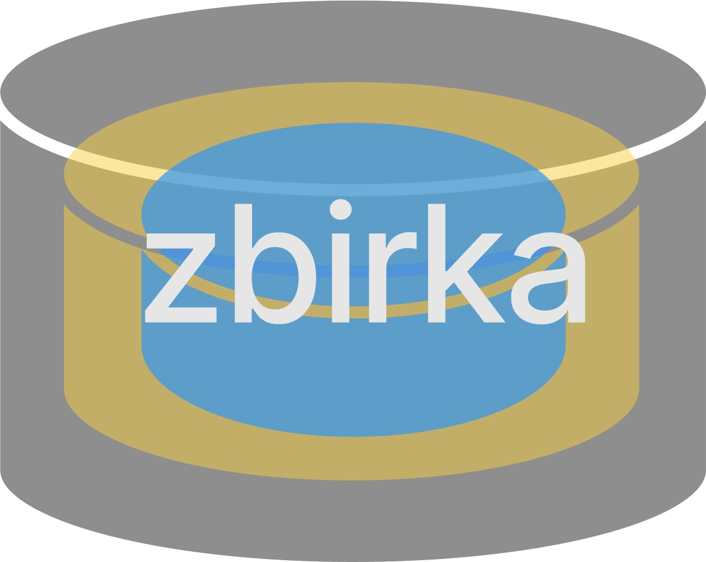

# Zbirka
## Projektarbeit IKA 9/22
### Ein Add On für Proxmox für Automatisierung und Integration von Software und Infrastruktur

Christian Weiss, Vito Skolan
07.06.2024

---

## Agenda

- Einführung
- Zielsetzung
- Projektübersicht
- Technische Details
- Herausforderungen & Lösungen
- Aktueller Stand
- Nächste Schritte
- Fragen & Antworten

---

## Einleitung

- Kurze Beschreibung des Projekts "Zbirka"
- Motivation hinter dem Projekt

---

## Problemstellung

- Herausforderungen bei der Installation benötigter Software
- Komplexität durch verschiedene lösungswege

---

## Projektziele

- [ **Hauptziel** ]: "Homelab" Software für nicht fortgeschrittene erreichbar machen Indem Wir als Zbirka die komplexe Installation via skripten bereitstellen
  - [ **Ziel 1 Terraform** ]: Nachdem die Infrastruktur von Proxmox mithilfe von Terraform ist Automatisiert wurde müssen wir die Software seite mit Skripten mithilfe von Ansible lösen
  - [ **Ziel 2 Ansible** ]: Ansible nutzen für die Intelligente installation von Software
- [ **Nächstes Hauptziel** ]: Ein Automatisiertes USB Installationstool das es ermöglicht Proxmox mit zbirka vorkonfiguriert zu nutzen

---

## Überblick über Zbirka

- Was ist Zbirka?
- Unique Selling Point (USP): Zentrale Plattform zur Integration und Automatisierung

---

## Architekturübersicht

- Schematische Darstellung der Architektur
- Erklärung der wichtigsten Komponenten (Proxmox, VMs, Container, Tools)

---

## Proxmox VE als Fundament

- Erklärung, warum Proxmox VE verwendet wird
- Vorteile von Proxmox VE

---

## Aufbau der virtuellen Maschinen (VMs)

- VM1: Ubuntu 22.04 mit Ansible und Docker
- VM2: NixOS
- VM3: Ubuntu 22.04 mit Terraform und Kestra
- Weitere VMs

---

## Container (LXC)

- Container1: Cloudflare
- Container2: Tailscale
- Weitere Container

---

## Netzwerk und Speicher

- Überblick über die Netzwerkarchitektur (VLANs, Firewall)
- Beschreibung der Speicherkonfiguration (NAS, Backup-Lösungen)

---

## Technische Herausforderungen

- Komplexität der Infrastrukturverwaltung
- Sicherheitsaspekte
- Integration verschiedener Tools

---

## Lösungsansätze

- Verwendung von deklarativen Tools wie NixOS
- Einsatz von Automatisierungstools (Ansible, Terraform)
- Einrichtung von Monitoring und Logging

---

## Fortschritte bisher

- Was wurde bisher erreicht?
- Funktionierende Proxmox-Umgebung
- Automatisierte Installation von Software in VMs

---

## Demonstration (optional)

- Live-Demo der aktuellen Implementierung (falls möglich)
- Screenshots oder Videos

---

## Weiterentwicklung von Zbirka

- Geplante Erweiterungen (weitere Tools, bessere Integration)
- Verbesserung der Automatisierung
- Stabilisierung und Skalierung

---

## Zeitplan

- Übersicht über den weiteren Projektzeitplan
- Meilensteine und Deadlines

---

## Fazit

- Zusammenfassung der wichtigsten Punkte
- Bedeutung und Potenzial von Zbirka

---

## Fragen & Antworten

- Raum für Fragen der Zuhörer
